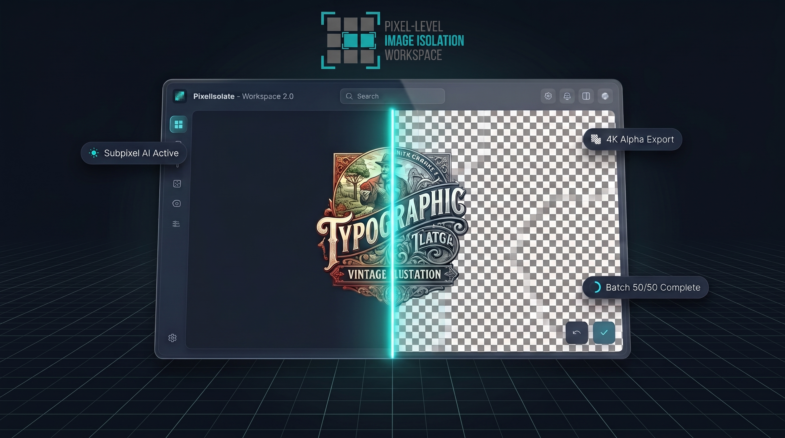

<div align="center">

  <h1>PixelIsolate</h1>

  <p>
    <strong>High-Precision AI Background Removal & 8K Upscaling Engine for POD & E-Commerce</strong>
  </p>

  <p>
    
      
    </a>
    
    
    
  </p>

  <p>
    <a href="https://pixelisolate.online"><strong>Explore Web App »</strong></a>
    &nbsp;•&nbsp;
    <a href="https://pixelisolate.online/blog">Read Community Guides</a>
  </p>

</div>

---

## 🚀 Overview

**PixelIsolate** is a production-ready web application engineered specifically to solve the biggest pain points in Print-on-Demand (POD) and E-Commerce graphic production: **white halos on dark apparel**, **pixelated edge contours**, and **slow single-file processing bottlenecks**.

By combining **subpixel edge feathering** with dual-engine AI (Neural Segmentation + Chroma Keying) and the official **Real-ESRGAN NCNN Vulkan GPU engine**, PixelIsolate allows creators to isolate, clean, and upscale image collections up to **8K print resolution** in seconds.

---

## ✨ Key Features

### ✂️ Subpixel AI Edge Isolation
* **Eliminate White Halos:** Strips away anti-aliased light background fringes that cause ugly borders on dark t-shirts (Amazon Merch, Etsy, Printify).
* **Intricate Detail Retention:** Preserves complex typography, distressed vintage textures, animal fur, and fine hair strands.
* **Dark Canvas Preview:** Inspect cutouts against black and navy canvas backgrounds inside the workspace at 200% zoom before publishing.

### ⚡ Bulk Batch Processing Engine
* Drag and drop up to **50 high-resolution design files** simultaneously.
* Process entire product catalogs at once and download clean transparent assets in a unified `.zip` archive.

### 🔍 AI Image Upscaler (Real-ESRGAN NCNN Vulkan)
* **4K & 8K Super-Resolution:** Scale images up to **3840px+ (4K Ultra HD)** and **7680px+ (8K Full Print)**.
* **Dual Model Pipeline:**
  * `realesrgan-x4plus-anime`: Tuned for vector art, logos, cartoons, and flat typography.
  * `realesrgan-x4plus`: Optimized for photorealistic imagery, fine apparel textures, and complex details.

### 🔒 WebCrypto API Client-Side Security
* Hardware-accelerated **AES-GCM 256-bit encryption** using the native browser `window.crypto.subtle` API.
* Fast, local buffer processing without heavy third-party cryptography dependencies.

### 🛍️ E-Commerce Marketplace Compliance
* **Amazon & eBay Ready:** Export pure white backgrounds (`#FFFFFF`) to meet strict main listing image compliance and prevent listing suppression.
* **300 DPI Alpha PNGs:** High-definition 24-bit exports ready for Direct-to-Garment (DTG) printing specifications.

---

## 🛠️ Tech Stack

* **Framework:** [Next.js](https://nextjs.org/) (App Router)
* **Language:** [TypeScript](https://www.typescriptlang.org/)
* **Styling:** [Tailwind CSS](https://tailwindcss.com/)
* **AI Engines:** Real-ESRGAN NCNN Vulkan (`realesrgan-x4plus` & `realesrgan-x4plus-anime`), RMBG / BiRefNet Neural Architecture
* **Cryptography:** Native Browser [WebCrypto API](https://developer.mozilla.org/en-US/docs/Web/API/Web_Crypto_API) (`AES-GCM 256-bit`)
* **Icons & Animation:** Lucide Icons, Framer Motion

---

## 💻 Local Development

### Prerequisites

* **Node.js** v18.0.0 or higher
* **npm**, **pnpm**, or **yarn**

### Quickstart

1. **Clone the repository:**
   ```bash
   git clone [https://github.com/your-username/pixelisolate.git](https://github.com/your-username/pixelisolate.git)
   cd pixelisolate

Install dependencies:

Bash
npm install
Configure Environment Variables:
Create a .env.local file in the root directory:

Code snippet
GEMINI_API_KEY=your_gemini_api_key_here
Start the development server:

Bash
npm run dev
Open http://localhost:3000 in your browser.

📄 License
Distributed under the MIT License. See LICENSE for more information.
